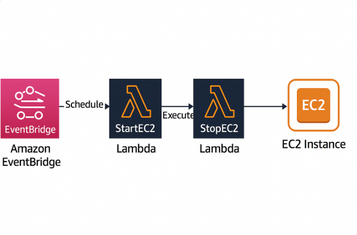

🧠 Smart Cloud Optimizer

Automated AWS EC2 management system using Lambda and EventBridge to minimize cloud costs by up to 80%.
Built with a serverless, event-driven architecture — ensuring your EC2 instances run only when needed.

🚀 Overview

The Smart Cloud Optimizer intelligently manages EC2 instances to reduce unnecessary runtime and optimize AWS Free Tier usage.
It automatically starts your EC2 instance at the beginning of the workday and stops it at the end — saving compute time and cost.

This project is a real-world implementation of AWS Cloud Automation and Cost Optimization principles.

🧩 Architecture

## 🏗️ Architecture Diagram

🔧 AWS Services Used:

☁️ Amazon EC2 — The compute instance (Nginx web server)

⚙️ AWS Lambda — Start/stop automation logic (Python)

🕒 Amazon EventBridge — Scheduled triggers (9 AM / 6 PM IST)

🔐 AWS IAM — Role-based access for secure Lambda execution

📊 Amazon CloudWatch — Log monitoring for Lambda executions

🔁 Workflow Diagram
EventBridge (Schedule)
        ↓
Lambda Functions (StartEC2 / StopEC2)
        ↓
EC2 Instance (Managed Lifecycle)

⚙️ Features

✅ Automatically starts EC2 at 9:00 AM IST
✅ Automatically stops EC2 at 6:00 PM IST
✅ Uses only AWS Free Tier services
✅ 100% serverless and automated
✅ Easy to deploy via AWS CLI
✅ Logs all executions in CloudWatch

🧱 Project Structure  
smart-cloud-optimizer/  
│  
├── scripts/  
│   ├── networking.sh       &emsp; &emsp;       #Creates VPC, subnet, security groups  
│   ├── ec2_setup.sh        &emsp; &emsp;       #Launches EC2 instance with Nginx  
│   ├── lambda.sh           &emsp; &emsp;       #Deploys Start/Stop Lambda functions  
│   ├── events.sh           &emsp; &emsp;       #Schedules EventBridge rules  
│  
├── start_ec2.py            &emsp; &emsp;       #Lambda code to start EC2  
├── stop_ec2.py             &emsp; &emsp;       #Lambda code to stop EC2  
├── resources.json          &emsp; &emsp;       #Stores all AWS resource IDs  
└── README.md               &emsp; &emsp;       #Documentation (this file)  

🪜 Deployment Steps
🧰 Pre-requisites

AWS CLI configured (aws configure)

IAM user with AdministratorAccess

EC2 key pair created

jq, zip installed (for shell scripts)

🚀 1️⃣ Setup Networking
bash scripts/networking.sh

⚙️ 2️⃣ Launch EC2 Instance
bash scripts/ec2_setup.sh

🤖 3️⃣ Deploy Lambda Functions
bash scripts/lambda.sh

🕒 4️⃣ Schedule Automation
bash scripts/events.sh

🧪 Testing the Automation
▶️ Start Instance Manually
aws lambda invoke --function-name StartEC2Lambda out.json

⏹️ Stop Instance Manually
aws lambda invoke --function-name StopEC2Lambda out.json

🔍 Check EC2 Status
aws ec2 describe-instances --instance-ids <your-instance-id> --query "Reservations[].Instances[].State.Name"

📈 Results
Time (IST)	Action	Expected EC2 State
9:00 AM	EventBridge → StartEC2Lambda	✅ Running
6:00 PM	EventBridge → StopEC2Lambda	🛑 Stopped
🧠 Key Learnings

Building AWS infrastructure via CLI and automation scripts

Serverless automation using Lambda + EventBridge

IAM role-based permissions

CloudWatch log monitoring

Free Tier cost optimization

🧰 Tech Stack
Layer	Technology
Compute	AWS EC2
Automation	AWS Lambda (Python 3.9)
Scheduling	Amazon EventBridge
Monitoring	CloudWatch
Access Control	IAM
Scripting	Bash + AWS CLI

🧭 Future Enhancements
Add Slack/SNS notifications for EC2 events

Integrate AWS Cost Explorer API for analytics

Multi-instance or tag-based automation

Deploy via Terraform or CloudFormation

🧑‍💻 Author

Md. Meraj
🎓 AWS re/Start Graduate | ☁️ Cloud Enthusiast | ⚙️ DevOps Learner
📫 GitHub
 • LinkedIn

⭐ Support

If you find this project helpful,
⭐ Star this repository on GitHub to support the project!

🏁 End Result

A fully automated, serverless system that keeps your EC2 instances active only during working hours — saving AWS costs effortlessly and demonstrating your AWS DevOps skills. 💡

📸 (Optional Add-on)

You can later upload:

A screenshot of your EventBridge rules

A CloudWatch logs snippet

The EC2 running page (Nginx welcome screen)

and embed them here like:

